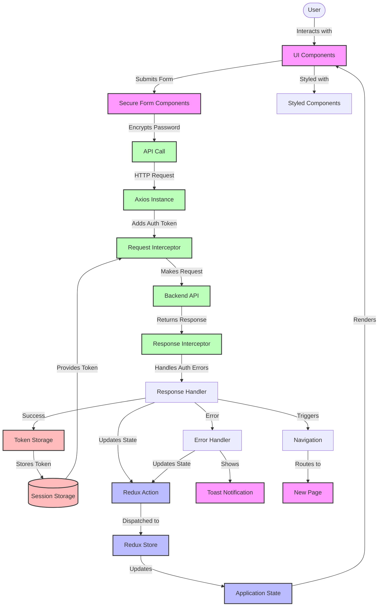

# Pita Bank Frontend Data Flow

## Data Flow Explanation

### User Interaction Layer
1. **User** interacts with the **UI Components** (forms, buttons, etc.)
2. **UI Components** capture user inputs and events

### Form Processing Layer
3. **Secure Form Components** handle form submissions
4. Passwords are encrypted before being sent to the backend
5. Form validation ensures data integrity

### API Communication Layer
6. **API Calls** are made through service modules
7. **Axios Instance** provides a configured HTTP client
8. **Request Interceptor** automatically adds authentication tokens
9. Requests are sent to the **Backend API**

### Response Handling Layer
10. **Response Interceptor** processes API responses
11. Authentication errors (401) trigger token removal and redirect
12. Successful responses update the application state
13. Error responses trigger error handling

### Token Management Layer
14. Authentication tokens are stored in **Session Storage**
15. Tokens are automatically included in subsequent API requests
16. Tokens are removed on logout or authentication errors

### State Management Layer
17. **Redux Actions** are dispatched based on API responses
18. **Redux Store** updates the application state
19. UI components re-render based on state changes

### Notification Layer
20. **Toast Notifications** provide feedback to users
21. Success and error messages are displayed as non-intrusive toasts

### Navigation Layer
22. Successful operations trigger navigation to new pages
23. Protected routes ensure authenticated access

## Object Types and Data Structures

### User Data
- **User**: `{ id: string, firstName: string, lastName: string, email: string, username?: string }`
- **Credentials**: `{ email: string, password: string }`
- **Registration Data**: `{ firstName: string, lastName: string, email: string, password: string }`

### Authentication
- **Auth State**: `{ user: User | null, token: string | null, isAuthenticated: boolean, loading: boolean, error: string | null }`
- **Auth Response**: `{ user: User, token: string }`

### Banking Data
- **Account**: `{ id: string, userId: string, accountNumber: string, accountType: string, balance: number, createdAt: string, updatedAt: string }`
- **Transaction**: `{ id: string, userId: string, fromAccountId: string, toAccountId: string, amount: number, type: string, description: string, status: string, createdAt: string, updatedAt: string }`

### UI Components
- **Form Data**: Various state objects for controlled form components
- **UI State**: Loading states, error states, and validation states