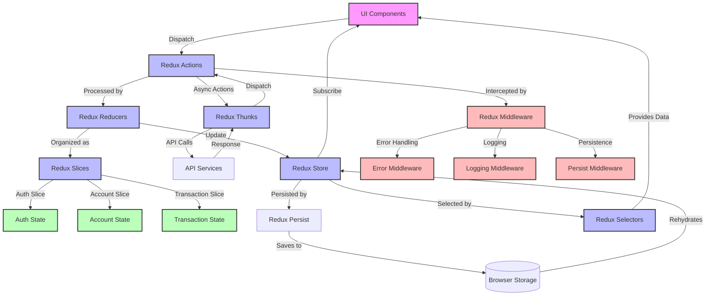

# Pita Bank Redux State Management



## Redux State Management Explanation

### Core Redux Pattern

1. **UI Components** dispatch actions when users interact with the application
2. **Redux Actions** describe what happened (e.g., `login/pending`, `login/fulfilled`)
3. **Redux Reducers** specify how the state changes in response to actions
4. **Redux Store** holds the complete application state
5. **UI Components** subscribe to the store and re-render when state changes

### Redux Toolkit Implementation

6. **Redux Slices** combine reducers, actions, and state for a specific feature
7. **Redux Thunks** handle asynchronous operations like API calls
8. **createAsyncThunk** generates pending/fulfilled/rejected action types
9. **Immer** allows "mutating" state in reducers while maintaining immutability

### State Organization

10. **Auth State**: User information, authentication status, tokens, and errors
11. **Account State**: User accounts, balances, and account-related operations
12. **Transaction State**: Transaction history, transfer operations, and status

### Middleware

13. **Error Middleware**: Intercepts rejected actions and displays toast notifications
14. **Redux Persist**: Persists and rehydrates state across page refreshes
15. **Serialization**: Handles non-serializable values in the Redux store

### Data Flow

16. User interacts with a component (e.g., submits login form)
17. Component dispatches a thunk action (e.g., `login(credentials)`)
18. Thunk makes an API call and dispatches pending/fulfilled/rejected actions
19. Reducers update state based on these actions
20. Components re-render with the new state

### Selectors

21. **useSelector** hook extracts specific pieces of state
22. Memoization prevents unnecessary re-renders
23. Selectors can compute derived data from the state

## Redux State Structure

```typescript
interface RootState {
  auth: {
    user: User | null;
    token: string | null;
    isAuthenticated: boolean;
    loading: boolean;
    error: string | null;
  };
  accounts: {
    accounts: Account[];
    loading: boolean;
    error: string | null;
  };
  transactions: {
    transactions: Transaction[];
    loading: boolean;
    error: string | null;
  };
}
```

## Key Redux Files

- **store/index.ts**: Configures the Redux store with middleware and persistence
- **store/slices/authSlice.ts**: Authentication state, login/register/logout actions
- **store/slices/accountSlice.ts**: Account management state and actions
- **store/slices/transactionSlice.ts**: Transaction state and actions
- **store/middleware/errorMiddleware.ts**: Handles API errors and displays notifications